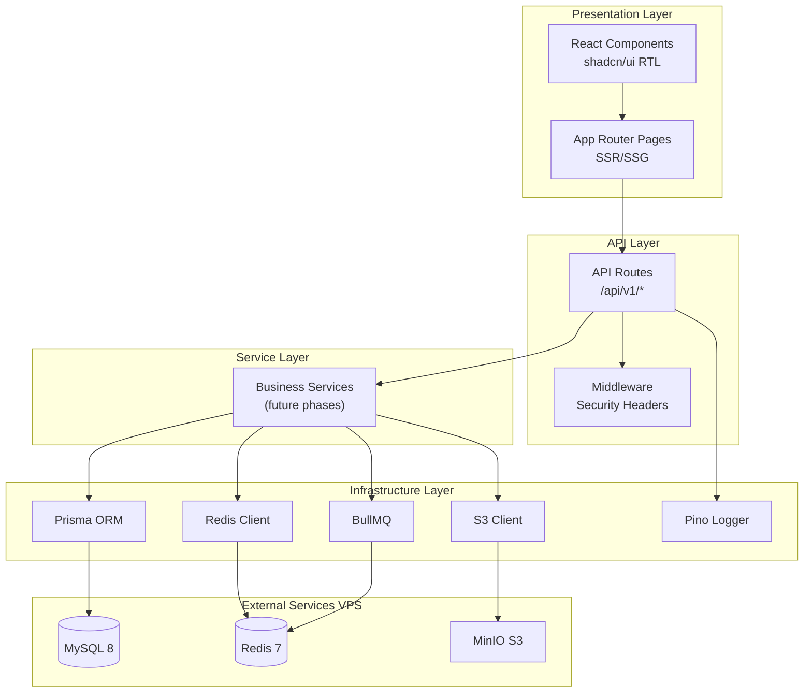
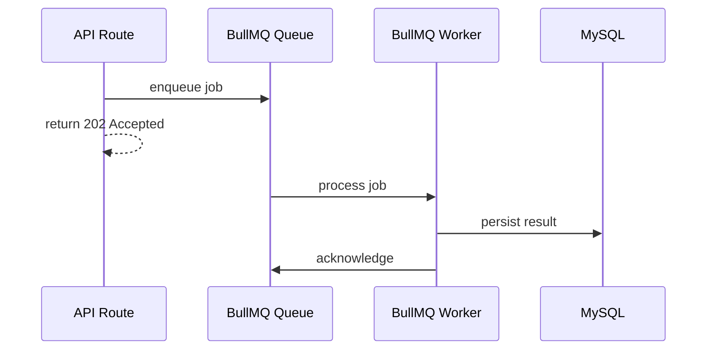
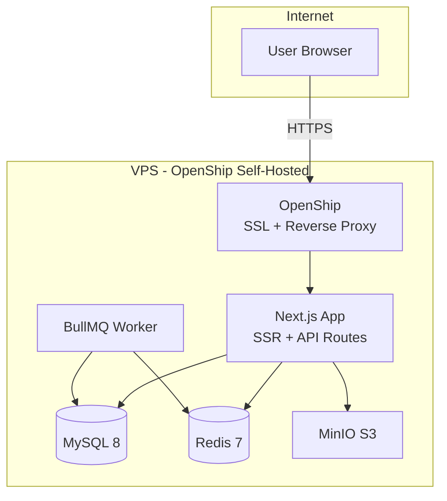

# یادداشت‌های معماری — Phase 0

**پروژه:** ComputerJobs.ir  
**نسخه:** 0.1.0

---

## ۱. نمای کلی معماری

ComputerJobs.ir یک پلتفرم monolithic با Next.js App Router است که API Routes، SSR/SSG، و background workers را در یک codebase مدیریت می‌کند.



---

## ۲. لایه‌های معماری

### ۲.۱ Presentation Layer

- **App Router Pages:** SSR برای SEO، SSG برای صفحات استاتیک
- **Components:** shadcn/ui با RTL، mobile-first
- **Metadata:** dynamic SEO per page

### ۲.۲ API Layer

- REST endpoints تحت `/api/v1/`
- Response envelope استاندارد
- Rate limiting (Phase 13)
- CSRF protection (Phase 13)

### ۲.۳ Service Layer

- Business logic جدا از route handlers
- Phase 0: فقط health service
- فازهای بعد: JobService, ResumeService, AIService, ...

### ۲.۴ Infrastructure Layer

- **Prisma:** database access با connection pooling
- **Redis:** caching + rate limiting + session (future)
- **BullMQ:** async job processing
- **S3:** file storage abstraction
- **Pino:** structured JSON logging

---

## ۳. Event-Driven + Queue-First



**Phase 0:** فقط connection skeleton — بدون business jobs.

**فازهای بعد:**
- Job indexing → search queue
- Email/SMS → notification queue
- AI processing → ai-queue
- Skill extraction → taxonomy queue

---

## ۴. OpenShip VPS Deployment Topology



### ۴.۱ OpenShip (Platform Layer)

- **Self-hosted** روی VPS — push-to-deploy از GitHub
- SSL خودکار (Let's Encrypt) برای دامنه `computerjobs.ir`
- مدیریت Environment Variables در dashboard OpenShip
- Build روی ماشین build؛ production server فقط containerها را اجرا می‌کند
- پشتیبانی از Docker Compose برای MySQL، Redis، MinIO

### ۴.۲ Application Layer (روی همان VPS)

| سرویس | نقش | شبکه |
|--------|-----|------|
| Next.js | SSR + API Routes | public via OpenShip proxy |
| BullMQ Worker | background jobs | internal Docker network |
| MySQL 8 | primary database | internal only |
| Redis 7 | cache + queue | internal only |
| MinIO | S3-compatible storage | internal (+ API via app) |

### ۴.۳ امنیت شبکه

- Redis و MySQL **بدون expose عمومی** — فقط Docker internal network
- Firewall VPS: پورت 80/443 (OpenShip) + SSH
- Secretها فقط در OpenShip env vars — never in git
- Backup strategy: daily MySQL dump (Phase 14)

---

## ۵. Security Baseline (Phase 0)

### ۵.۱ HTTP Security Headers

```
X-Content-Type-Options: nosniff
X-Frame-Options: DENY
Referrer-Policy: strict-origin-when-cross-origin
Permissions-Policy: camera=(), microphone=(), geolocation=()
Content-Security-Policy: default-src 'self'; ...
```

### ۵.۲ Secret Management

- `.env.example` — template بدون مقادیر واقعی
- `.env` — gitignored
- OpenShip Environment Variables — production secrets
- `docker/.env` — docker-compose env file (local/staging)

### ۵.۳ Input Validation

- zod schema validation برای env vars
- API request validation (فازهای بعد)

---

## ۶. Observability Hooks

### ۶.۱ Logging

- **pino** structured JSON logs
- Request correlation ID در headers
- Log levels: fatal, error, warn, info, debug, trace

### ۶.۲ Health Checks

| Endpoint | نوع | بررسی |
|----------|-----|--------|
| `GET /api/v1/health` | Liveness | process alive |
| `GET /api/v1/health/deep` | Readiness | MySQL + Redis ping |

### ۶.۳ Error Handling

- Global error boundary در App Router
- API error handler با envelope استاندارد
- Unhandled rejection logging

---

## ۷. Abstraction Layers (Spec Only — Phase 0)

| Layer | Interface | Implementation |
|-------|-----------|----------------|
| AI Gateway | `AIProvider` | OpenAI, Gemini, Groq, ... (Phase 7) |
| Storage | `StorageProvider` | MinIO/S3 (Phase 0 stub) |
| Queue | `QueueProvider` | BullMQ (Phase 0 skeleton) |
| Notification | `NotificationProvider` | Email, SMS, In-App (Phase 10) |
| Payment | `PaymentProvider` | TBD (Phase 9) |

---

## ۸. مراجع

- [TECHNICAL_SPEC.md](./TECHNICAL_SPEC.md)
- [DATABASE_DESIGN.md](./DATABASE_DESIGN.md)
- [API_DESIGN.md](./API_DESIGN.md)
