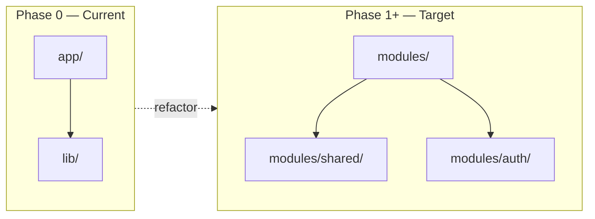

# CTO Report — Phase 0: Foundation & Architecture

**پروژه:** ComputerJobs.ir  
**نسخه:** 0.1.0  
**Commit:** `4ae895a`  
**تاریخ:** 1404/04/28  
**تهیه‌کننده:** Cursor Agent  
**وضعیت:** ✅ **Approved** (2026-07-19) — conditions implemented

---

## Executive Summary

Phase 0 approved by CTO with conditions. Follow-up refactor implemented:

- `src/modules/` feature-first structure
- `src/lib/` → `modules/shared/` migration
- AI, taxonomy, location skeletons with subfolders
- `develop` branch, ADR/RFC process, split Rulebook

**Next:** Phase 1 IAM spec → approval → `feature/auth`

---

## 1. Architecture Review

### ✅ نقاط قوت

- لایه infrastructure (Prisma, Redis, BullMQ, S3 stub) جدا از routes
- API versioning: `/api/v1/`
- Response envelope استاندارد
- Docker Compose برای سرویس‌های داده
- OpenShip deployment topology مستند شده
- Event-driven skeleton (BullMQ) از روز اول

### ⚠️ انحراف از Rulebook

| Rulebook | وضعیت فعلی | شدت |
|----------|------------|-----|
| `src/modules/{feature}/` | `src/lib/` + `src/app/api/` | **HIGH** |
| Business logic outside API routes | فعلاً فقط health — OK | LOW |
| `develop` branch workflow | فقط `main` | MED |

**توصیه:** از **Phase 1** ساختار `src/modules/` را معرفی کنید. `src/lib/` فقط برای cross-cutting infra (`shared/`) باقی بماند:

```text
src/modules/shared/   ← prisma, redis, logger, env
src/modules/auth/     ← Phase 1
src/lib/              ← deprecate تدریجی
```

### 📐 Diagram وضعیت فعلی vs هدف



---

## 2. Security Review

جزئیات: [SECURITY_REVIEW.md](./SECURITY_REVIEW.md)

| حوزه | Phase 0 | Production Ready |
|------|---------|------------------|
| Security Headers | ✅ Partial (no HSTS) | ❌ Phase 13 |
| Secrets | ✅ | ✅ |
| Auth/RBAC | N/A | Phase 1 |
| Rate Limiting | ❌ | Phase 13 |
| CSRF | ❌ | Phase 13 |

**ریسک کلیدی:** CSP با `unsafe-eval` — برای Phase 0 OK، قبل production حذف شود.

**تأیید امنیت Phase 0:** ✅ Baseline مناسب

---

## 3. Database Review

جزئیات: [DATABASE_DESIGN.md](./DATABASE_DESIGN.md)

| Rulebook Rule | وضعیت |
|---------------|--------|
| UUID PKs | ✅ در spec — هنوز جدول business نداریم |
| Audit fields | ✅ در spec |
| Soft delete | ✅ در spec |
| snake_case tables | ✅ در spec |
| Migrations | ✅ init migration (empty) |
| Seed data | ❌ Phase 2–3 |

**نکته:** Prisma v6 استفاده شده (نه v7) — تصمیم آگاهانه برای stability.

**Migration file:** `20260719120000_init` — خالی و صحیح برای Phase 0.

---

## 4. SEO Review

جزئیات: [SEO_REVIEW.md](./SEO_REVIEW.md)

| Rulebook Rule | وضعیت |
|---------------|--------|
| Title + Description | ✅ |
| OpenGraph | ✅ |
| Canonical | ⚠️ فقط metadataBase |
| Structured Data | ❌ Phase 12 |
| sitemap.xml | ❌ Phase 12 (robots.txt reference دارد) |
| Readable URLs | N/A Phase 0 |
| Core Web Vitals | ⚠️ not measured |

**تأیید SEO Phase 0:** ✅ Baseline landing OK

---

## 5. AI & Graceful Degradation

Phase 0 شامل AI implementation نیست — ✅ مطابق Rulebook (AI optional).

AI Gateway spec در ARCHITECTURE.md — پیاده‌سازی Phase 7.

---

## 6. Deployment Review

| Rulebook | وضعیت |
|----------|--------|
| Docker | ✅ Dockerfile + compose |
| OpenShip VPS | ✅ DEPLOYMENT.md |
| Health endpoints | ✅ |
| No vendor lock-in | ✅ abstraction stubs |

---

## 7. Risks

| ID | Risk | Probability | Impact | Mitigation |
|----|------|-------------|--------|------------|
| R1 | `src/lib/` structure conflicts with Rulebook | High | Med | Refactor to `modules/` in Phase 1 |
| R2 | CSP too permissive | Med | Med | Harden Phase 13 |
| R3 | robots.txt references missing sitemap | Low | Low | Fix Phase 12 |
| R4 | No `develop` branch yet | Med | Low | Create before Phase 1 |
| R5 | Docker not on dev machine (Windows) | Med | Low | VPS/OpenShip for integration test |
| R6 | JWT placeholders in .env.example | Low | High if misused | Document + OpenShip secrets |

---

## 8. Technical Debt

| ID | Debt | Priority | Phase to Fix |
|----|------|----------|--------------|
| TD1 | Layer-based `src/lib/` vs feature modules | **P0** | Phase 1 |
| TD2 | No automated tests | P1 | Phase 1+ |
| TD3 | No `develop` branch | P2 | Before Phase 1 |
| TD4 | Missing HSTS | P2 | Phase 13 |
| TD5 | public/vercel.svg unused branding | P3 | Cleanup |
| TD6 | package.json prisma seed deprecation warning | P3 | Phase 1 |
| TD7 | Conventional Commits not enforced in CI | P2 | Phase 1 |

---

## 9. Recommendations

### Must Fix Before Phase 1 (CTO Decision Required)

1. **تأیید refactor plan** برای `src/modules/` — auth module اولین ماژول
2. **ایجاد branch `develop`** — workflow طبق Rulebook
3. **حذف/جایگزینی** فایل‌های template Vercel (`public/vercel.svg`, links)

### Should Fix in Phase 1

4. Auth module با JWT + RBAC + password hashing
5. Rate limiting skeleton برای login/register
6. Unit test setup (Vitest/Jest)
7. Conventional Commits در commit messages

### Deferred (Approved)

8. Structured Data → Phase 12
9. Full security hardening → Phase 13
10. Observability dashboard → Phase 14

---

## 10. Rulebook Compliance Matrix

| Section | Compliance | Notes |
|---------|------------|-------|
| Core Principles | ✅ | Documented |
| Feature-First Architecture | ⚠️ 40% | Refactor Phase 1 |
| AI Rules | ✅ N/A | Spec only |
| Database Rules | ✅ Spec | No tables yet |
| Security Rules | ⚠️ 50% | Baseline only |
| API Rules | ✅ | v1 + envelope |
| SEO Rules | ⚠️ 40% | Baseline |
| Git Rules | ⚠️ 60% | No develop branch |
| Documentation Rules | ✅ | All phase-0 docs |
| Deployment Rules | ✅ | OpenShip VPS |
| Review Rules | ✅ | This report |

**Overall Compliance Score: ~65%** — acceptable for foundation phase with documented debt.

---

## 11. CTO Decision Checklist

- [x] **APPROVE** Phase 0 foundation — 2026-07-19
- [x] **Conditions implemented** — see `docs/DECISIONS.md` D-005 through D-011

### CTO Comments (recorded)

```
Phase 0 Approved with conditions:
- src/modules from Phase 1 (not deferred)
- AI/taxonomy/location subfolder skeletons
- develop branch + ADR/RFC + split Rulebook
- Phase 1 = IAM (Identity & Access Management)
```

---

## 12. Files for Review

| File | Purpose |
|------|---------|
| [.cto/RULEBOOK.md](../../.cto/RULEBOOK.md) | Mandatory standards |
| [TECHNICAL_SPEC.md](./TECHNICAL_SPEC.md) | Phase spec |
| [ARCHITECTURE.md](./ARCHITECTURE.md) | Architecture |
| [SECURITY_REVIEW.md](./SECURITY_REVIEW.md) | Security |
| [SEO_REVIEW.md](./SEO_REVIEW.md) | SEO |
| [PHASE_SUMMARY.md](./PHASE_SUMMARY.md) | Summary |
| [DEPLOYMENT.md](../DEPLOYMENT.md) | OpenShip VPS |

**GitHub:** https://github.com/accmobile1397-tech/computerjobs

---

## 13. Next Steps (After CTO Approval)

1. Apply CTO feedback fixes → commit → push
2. Create `develop` branch
3. Begin Phase 1 spec (Auth & RBAC) → **wait for approval** → implement

---

*Generated per `.cto/RULEBOOK.md` Review Rules.*
