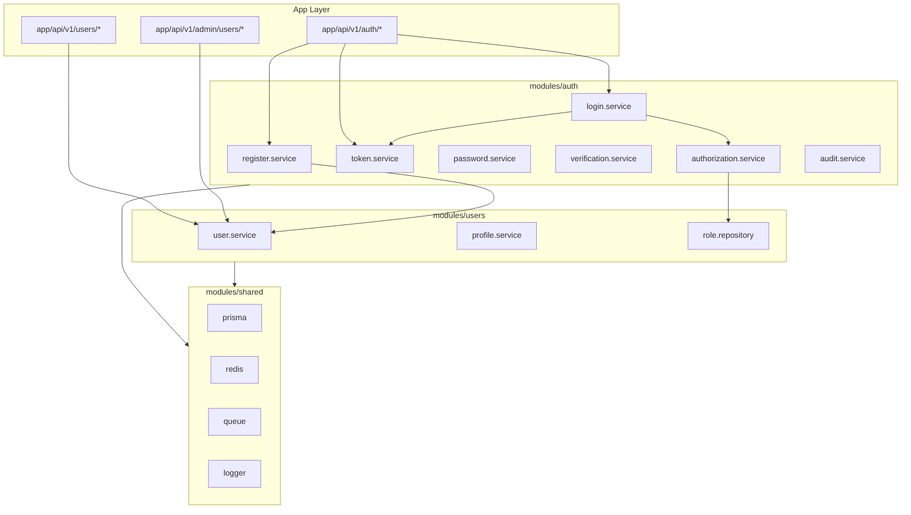
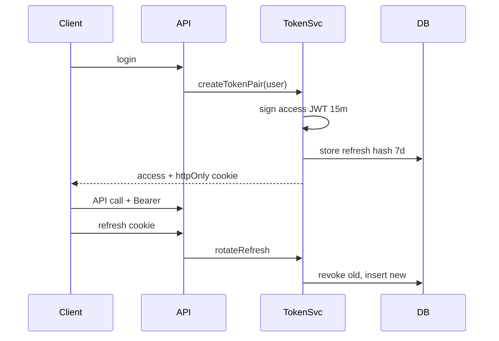

# Architecture — Phase 1: IAM

**فاز:** 1 — Spec only

---

## ۱. Module Boundaries



---

## ۲. Folder Structure (Target)

```text
src/modules/auth/
  services/
    register.service.ts
    login.service.ts
    token.service.ts
    password.service.ts
    verification.service.ts
    authorization.service.ts
    audit.service.ts
  repositories/
    refresh-token.repository.ts
    verification-token.repository.ts
    password-reset.repository.ts
    audit-log.repository.ts
  validators/
    register.schema.ts
    login.schema.ts
  types/
    jwt-payload.ts
    auth-result.ts
  seed/
    roles.seed.ts
    permissions.seed.ts

src/modules/users/
  services/
    user.service.ts
    profile.service.ts
    admin-user.service.ts
  repositories/
    user.repository.ts
    role.repository.ts
    permission.repository.ts
  validators/
    update-user.schema.ts
  types/
    user.dto.ts
```

---

## ۳. Layer Rules

| Layer | Responsibility |
|-------|----------------|
| API Route | Parse request, call service, return envelope |
| Service | Business logic, orchestration, audit |
| Repository | Prisma queries only |
| Validator | zod schemas |

**Forbidden:** Prisma in route handlers. Business logic in routes.

---

## ۴. Token Architecture



---

## ۵. Authorization Flow

```text
Request → middleware (optional JWT parse)
       → route handler
       → authorization.service.requirePermission(user, 'jobs:create')
       → load permissions from JWT or cache Redis
       → allow / PERMISSION_DENIED
```

---

## ۶. Async Jobs (BullMQ)

| Job | Queue | Trigger |
|-----|-------|---------|
| `auth:send-verification-email` | default | register |
| `auth:send-password-reset` | default | forgot-password |

Email provider stub Phase 1 — log only or console; real SMTP Phase 10.

---

## ۷. Dependencies

| Module | Depends on |
|--------|------------|
| auth | users (create user), shared |
| users | shared only |
| Phase 2+ | auth public API for `getCurrentUser()` |

**Export:** `users/services/user.service.ts` — public methods only for other modules.

---

## ۸. Security Integration

- argon2 in `auth/services/password.service.ts`
- JWT sign/verify in `auth/services/token.service.ts`
- env: `JWT_ACCESS_SECRET`, `JWT_REFRESH_SECRET`, TTLs

---

## ۹. References

- `.cto/ARCHITECTURE_RULES.md`
- [TECHNICAL_SPEC.fa.md](./TECHNICAL_SPEC.fa.md)
- `docs/adr/0001-feature-first.md`
