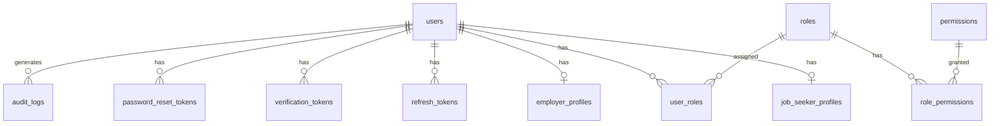

# Database Design — Phase 1: IAM

**پروژه:** ComputerJobs.ir  
**DBMS:** MySQL 8 · **ORM:** Prisma 6  
**فاز:** 1 — **Spec only — no migration yet**

---

## ۱. ERD Overview



---

## ۲. Enums (Prisma)

```prisma
enum UserPrimaryType {
  JOB_SEEKER
  EMPLOYER
  ADMIN
  SUPER_ADMIN
}

enum UserStatus {
  PENDING
  ACTIVE
  SUSPENDED
  BANNED
  DELETED
}

enum AuditAction {
  REGISTER
  LOGIN_SUCCESS
  LOGIN_FAILED
  LOGOUT
  LOGOUT_ALL
  PASSWORD_RESET_REQUEST
  PASSWORD_RESET
  EMAIL_VERIFIED
  EMAIL_VERIFICATION_SENT
  ACCOUNT_LOCKED
  SESSION_REVOKED
  USER_SUSPENDED
  USER_BANNED
}
```

> **Roles/Permissions:** NOT enum — table-driven only.

---

## ۳. Prisma Models (Spec)

### ۳.۱ User

```prisma
model User {
  id                   String           @id @default(uuid())
  email                String           @unique @db.VarChar(255)
  passwordHash         String           @map("password_hash") @db.VarChar(255)
  primaryType          UserPrimaryType  @map("primary_type")
  status               UserStatus       @default(PENDING)
  emailVerified        Boolean          @default(false) @map("email_verified")
  emailVerifiedAt      DateTime?        @map("email_verified_at")
  phone                String?          @db.VarChar(20)
  phoneVerified        Boolean          @default(false) @map("phone_verified")
  phoneVerifiedAt      DateTime?        @map("phone_verified_at")
  lastLoginAt          DateTime?        @map("last_login_at")
  failedLoginAttempts  Int              @default(0) @map("failed_login_attempts")
  lockedUntil          DateTime?        @map("locked_until")
  twoFactorEnabled     Boolean          @default(false) @map("two_factor_enabled")
  twoFactorSecret      String?          @map("two_factor_secret") @db.VarChar(512)
  createdAt            DateTime         @default(now()) @map("created_at")
  updatedAt            DateTime         @updatedAt @map("updated_at")
  deletedAt            DateTime?        @map("deleted_at")

  jobSeekerProfile     JobSeekerProfile?
  employerProfile      EmployerProfile?
  userRoles            UserRole[]
  refreshTokens        RefreshToken[]
  verificationTokens   VerificationToken[]
  passwordResetTokens  PasswordResetToken[]
  auditLogs            AuditLog[]

  @@index([email])
  @@index([status])
  @@index([primaryType])
  @@index([deletedAt])
  @@map("users")
}
```

### ۳.۲ JobSeekerProfile

```prisma
model JobSeekerProfile {
  id          String    @id @default(uuid())
  userId      String    @unique @map("user_id")
  displayName String?   @map("display_name") @db.VarChar(120)
  createdAt   DateTime  @default(now()) @map("created_at")
  updatedAt   DateTime  @updatedAt @map("updated_at")
  deletedAt   DateTime? @map("deleted_at")

  user User @relation(fields: [userId], references: [id])

  @@map("job_seeker_profiles")
}
```

### ۳.۳ EmployerProfile

```prisma
model EmployerProfile {
  id          String    @id @default(uuid())
  userId      String    @unique @map("user_id")
  displayName String?   @map("display_name") @db.VarChar(120)
  createdAt   DateTime  @default(now()) @map("created_at")
  updatedAt   DateTime  @updatedAt @map("updated_at")
  deletedAt   DateTime? @map("deleted_at")

  user User @relation(fields: [userId], references: [id])

  @@map("employer_profiles")
}
```

### ۳.۴ Role

```prisma
model Role {
  id          String    @id @default(uuid())
  slug        String    @unique @db.VarChar(64)
  nameFa      String    @map("name_fa") @db.VarChar(120)
  description String?   @db.VarChar(500)
  isSystem    Boolean   @default(true) @map("is_system")
  createdAt   DateTime  @default(now()) @map("created_at")
  updatedAt   DateTime  @updatedAt @map("updated_at")
  deletedAt   DateTime? @map("deleted_at")

  userRoles       UserRole[]
  rolePermissions RolePermission[]

  @@map("roles")
}
```

### ۳.۵ Permission

```prisma
model Permission {
  id          String    @id @default(uuid())
  slug        String    @unique @db.VarChar(128)
  nameFa      String    @map("name_fa") @db.VarChar(120)
  description String?   @db.VarChar(500)
  createdAt   DateTime  @default(now()) @map("created_at")
  updatedAt   DateTime  @updatedAt @map("updated_at")
  deletedAt   DateTime? @map("deleted_at")

  rolePermissions RolePermission[]

  @@map("permissions")
}
```

### ۳.۶ UserRole

```prisma
model UserRole {
  id        String    @id @default(uuid())
  userId    String    @map("user_id")
  roleId    String    @map("role_id")
  createdAt DateTime  @default(now()) @map("created_at")
  deletedAt DateTime? @map("deleted_at")

  user User @relation(fields: [userId], references: [id])
  role Role @relation(fields: [roleId], references: [id])

  @@unique([userId, roleId])
  @@index([userId])
  @@index([roleId])
  @@map("user_roles")
}
```

### ۳.۷ RolePermission

```prisma
model RolePermission {
  id           String    @id @default(uuid())
  roleId       String    @map("role_id")
  permissionId String    @map("permission_id")
  createdAt    DateTime  @default(now()) @map("created_at")
  deletedAt    DateTime? @map("deleted_at")

  role       Role       @relation(fields: [roleId], references: [id])
  permission Permission @relation(fields: [permissionId], references: [id])

  @@unique([roleId, permissionId])
  @@index([roleId])
  @@index([permissionId])
  @@map("role_permissions")
}
```

### ۳.۸ RefreshToken

```prisma
model RefreshToken {
  id        String    @id @default(uuid())
  userId    String    @map("user_id")
  tokenHash String    @map("token_hash") @db.VarChar(64)
  expiresAt DateTime  @map("expires_at")
  revokedAt DateTime? @map("revoked_at")
  userAgent String?   @map("user_agent") @db.VarChar(512)
  ipAddress String?   @map("ip_address") @db.VarChar(45)
  createdAt DateTime  @default(now()) @map("created_at")

  user User @relation(fields: [userId], references: [id])

  @@index([userId])
  @@index([tokenHash])
  @@index([expiresAt])
  @@map("refresh_tokens")
}
```

### ۳.۹ VerificationToken (email)

```prisma
model VerificationToken {
  id        String    @id @default(uuid())
  userId    String    @map("user_id")
  tokenHash String    @map("token_hash") @db.VarChar(64)
  type      String    @default("EMAIL") @db.VarChar(32)
  expiresAt DateTime  @map("expires_at")
  usedAt    DateTime? @map("used_at")
  createdAt DateTime  @default(now()) @map("created_at")

  user User @relation(fields: [userId], references: [id])

  @@index([tokenHash])
  @@index([userId])
  @@map("verification_tokens")
}
```

### ۳.۱۰ PasswordResetToken

```prisma
model PasswordResetToken {
  id        String    @id @default(uuid())
  userId    String    @map("user_id")
  tokenHash String    @map("token_hash") @db.VarChar(64)
  expiresAt DateTime  @map("expires_at")
  usedAt    DateTime? @map("used_at")
  createdAt DateTime  @default(now()) @map("created_at")

  user User @relation(fields: [userId], references: [id])

  @@index([tokenHash])
  @@index([userId])
  @@map("password_reset_tokens")
}
```

### ۳.۱۱ AuditLog

```prisma
model AuditLog {
  id        String      @id @default(uuid())
  userId    String?     @map("user_id")
  action    AuditAction
  ipAddress String?     @map("ip_address") @db.VarChar(45)
  userAgent String?     @map("user_agent") @db.VarChar(512)
  metadata  Json?
  createdAt DateTime    @default(now()) @map("created_at")

  user User? @relation(fields: [userId], references: [id])

  @@index([userId])
  @@index([action])
  @@index([createdAt])
  @@map("audit_logs")
}
```

---

## ۴. Seed Data (Phase 1)

### ۴.۱ Roles

| slug | nameFa |
|------|--------|
| job_seeker | کارجو |
| employer | کارفرما |
| admin | مدیر |
| super_admin | مدیر ارشد |

### ۴.۲ Permissions + RolePermission

- Seed ~20 permissions (see TECHNICAL_SPEC.fa.md §3.3)  
- `super_admin` → all permissions  
- `admin` → subset admin:*  
- `job_seeker` / `employer` → self-scoped permissions  

### ۴.۳ SuperAdmin User

- One seeded SuperAdmin (email from env `SEED_SUPERADMIN_EMAIL`)  
- **Never** commit password — generated at seed runtime  

Location: `src/modules/auth/seed/` + `prisma/seed.ts` orchestration

---

## ۵. Indexes Strategy

| Query pattern | Index |
|---------------|-------|
| Login by email | users.email unique |
| Active users | status + deletedAt |
| Permission check | user_roles.userId → role_permissions |
| Token lookup | tokenHash on token tables |
| Audit by user/date | audit_logs composite |

---

## ۶. Soft Delete Rules

- `users`, profiles, roles, permissions: soft delete via `deletedAt`  
- `refresh_tokens`: hard revoke via `revokedAt` (not soft delete)  
- `audit_logs`: **never delete** — append only  

---

## ۷. Migration Plan

```bash
# After CTO approval only:
npx prisma migrate dev --name phase1_iam
npx prisma db seed
```

Migration name: `phase1_iam` — single migration for all Phase 1 tables.

---

## ۸. References

- [TECHNICAL_SPEC.fa.md](./TECHNICAL_SPEC.fa.md)
- `.cto/DATABASE_RULES.md`
- `docs/adr/0002-prisma.md`
