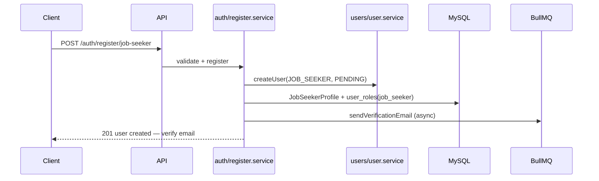
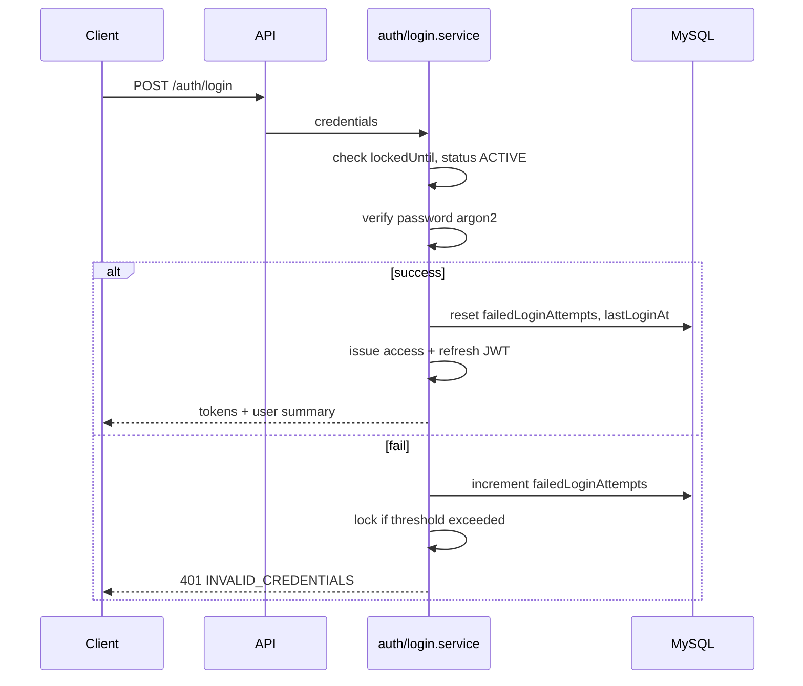

# مشخصات فنی — Phase 1: Identity & Access Management (IAM)

**پروژه:** ComputerJobs.ir  
**نسخه:** 1.0.0-spec  
**فاز:** 1  
**وضعیت:** ⏳ در انتظار تأیید CTO — **بدون پیاده‌سازی کد**

---

## ۱. هدف Phase 1

Phase 1 **پایه هویت و دسترسی** کل پلتفرم را تثبیت می‌کند تا فازهای بعد (رزومه، آگهی، پرداخت، ادمین) بدون بازنویسی RBAC یا User Management ساخته شوند.

### ۱.۱ محدوده (In Scope)

- ثبت‌نام کارجو (Job Seeker) و کارفرما (Employer)
- ورود، خروج، refresh token
- JWT Access Token + JWT Refresh Token
- RBAC کامل با جداول مستقل (Role, Permission, UserRole, RolePermission)
- انواع کاربر: JobSeeker, Employer, Admin, SuperAdmin
- تأیید ایمیل، بازیابی رمز عبور
- مدیریت وضعیت کاربر (ACTIVE, PENDING, SUSPENDED, BANNED, DELETED)
- قفل حساب پس از تلاش‌های ناموفق
- Audit logging برای رویدادهای امنیتی IAM
- Schema آماده 2FA (بدون پیاده‌سازی UI/flow)
- ماژول‌های `src/modules/auth/` و `src/modules/users/`

### ۱.۲ خارج از محدوده (Out of Scope)

| قابلیت | دلیل | فاز |
|--------|------|-----|
| OAuth / Google / GitHub / Social Login | تصمیم CTO | — |
| پیاده‌سازی 2FA (TOTP/SMS) | Schema فقط | آینده |
| SMS verification flow | Schema `phoneVerified` آماده | Phase 10 |
| Rate limiting production-grade | Skeleton اختیاری | Phase 13 |
| Admin panel UI کامل | API + permissions فقط | Phase admin |
| Company profile | Phase 4 | 4 |

---

## ۲. انواع کاربر (User Types)

هر **حساب** دقیقاً یک `primaryType` دارد. Admin و SuperAdmin حساب‌های جداگانه با نوع متمایز هستند.

| نوع | شناسه | توضیح |
|-----|--------|--------|
| **Job Seeker** | `JOB_SEEKER` | کارجو — رزومه، درخواست شغل |
| **Employer** | `EMPLOYER` | کارفرما — ثبت آگهی، مدیریت شرکت |
| **Admin** | `ADMIN` | مدیر عملیاتی — taxonomy، location، ads |
| **Super Admin** | `SUPER_ADMIN` | دسترسی کامل سیستم |

### ۲.۱ مدل مفهومی

```text
User (هویت مرکزی)
 ├── primaryType: JOB_SEEKER | EMPLOYER | ADMIN | SUPER_ADMIN
 ├── JobSeekerProfile   (1:1 اگر JOB_SEEKER)
 ├── EmployerProfile    (1:1 اگر EMPLOYER)
 └── UserRole[]         (RBAC — چند نقش ممکن است)
```

> **نکته:** `primaryType` نوع **حساب** است. **Role** در RBAC جداگانه و از جدول `roles` می‌آید — Enum ثابت برای Role/Permission **ممنوع**.

---

## ۳. RBAC Model

### ۳.۱ جداول (مستقل — نه Enum)

| جدول | نقش |
|------|-----|
| `roles` | نقش‌های سیستم (قابل seed و توسعه admin) |
| `permissions` | مجوزهای атомیک (`resource:action`) |
| `user_roles` | تخصیص نقش به کاربر |
| `role_permissions` | تخصیص مجوز به نقش |

### ۳.۲ نقش‌های اولیه (Seed)

| slug | نام فارسی | primaryType مرتبط |
|------|-----------|-------------------|
| `job_seeker` | کارجو | JOB_SEEKER |
| `employer` | کارفرما | EMPLOYER |
| `admin` | مدیر | ADMIN |
| `super_admin` | مدیر ارشد | SUPER_ADMIN |

### ۳.۳ نمونه Permissions (Seed)

```text
users:read:self
users:update:self
jobs:create
jobs:read
jobs:update:own
jobs:delete:own
resumes:create
resumes:read:own
admin:users:read
admin:users:suspend
admin:roles:manage
admin:permissions:manage
```

### ۳.۴ قوانین Authorization

1. **Authentication ≠ Authorization** — هر endpoint محافظت‌شده هر دو را بررسی می‌کند  
2. Permission check در **service layer** (`auth/services/authorization.service.ts`)  
3. SuperAdmin: نقش `super_admin` → bypass permission یا `*` (تصمیم پیاده‌سازی: all permissions via seed)  
4. Route handler فقط delegate — بدون logic  

---

## ۴. وضعیت کاربر (User Status)

| Status | معنی | ورود مجاز؟ |
|--------|------|------------|
| `PENDING` | ثبت‌نام شده — ایمیل تأیید نشده | ❌ |
| `ACTIVE` | فعال | ✅ |
| `SUSPENDED` | تعلیق موقت توسط admin | ❌ |
| `BANNED` | مسدود دائم | ❌ |
| `DELETED` | soft delete (`deletedAt`) | ❌ |

**انتقال وضعیت:**

```text
REGISTER → PENDING
EMAIL_VERIFIED → ACTIVE
ADMIN_SUSPEND → SUSPENDED
ADMIN_BAN → BANNED
USER_DELETE / ADMIN_DELETE → DELETED (soft)
```

---

## ۵. فیلدهای User (Schema)

### ۵.۱ هویت و امنیت

| فیلد | نوع | توضیح |
|------|-----|--------|
| `id` | UUID | PK |
| `email` | string unique | normalized lowercase |
| `passwordHash` | string | argon2id — never plain |
| `primaryType` | enum/string | JOB_SEEKER, EMPLOYER, ADMIN, SUPER_ADMIN |
| `status` | enum | PENDING, ACTIVE, … |
| `emailVerified` | boolean | default false |
| `emailVerifiedAt` | datetime? | |
| `phone` | string? | E.164 optional |
| `phoneVerified` | boolean | default false |
| `phoneVerifiedAt` | datetime? | |
| `lastLoginAt` | datetime? | |
| `failedLoginAttempts` | int | default 0 |
| `lockedUntil` | datetime? | null = not locked |
| `twoFactorEnabled` | boolean | default false — **بدون flow Phase 1** |
| `twoFactorSecret` | string? encrypted | **بدون flow Phase 1** |
| `createdAt`, `updatedAt`, `deletedAt` | audit | |

### ۵.۲ JobSeekerProfile / EmployerProfile

فیلدهای پروفایل سبک Phase 1 (گسترش در فازهای بعد):

- `userId` (FK unique)
- `displayName`
- `createdAt`, `updatedAt`, `deletedAt`

---

## ۶. Registration Flow

### ۶.۱ Job Seeker



**ورودی:** email, password, displayName (optional)  
**خروجی:** `{ userId, email, status: PENDING }` — **بدون token** تا email verified  
**رمز:** min 8 chars, complexity rules در validator  

### ۶.۲ Employer

مشابه با `POST /auth/register/employer` + `EmployerProfile` + role `employer`.

### ۶.۳ Admin / SuperAdmin

**ثبت‌نام عمومی ممنوع.** فقط SuperAdmin via seed یا invite داخلی (Phase 1: seed یک SuperAdmin).

---

## ۷. Login Flow



**قفل حساب:** پس از **5** تلاش ناموفق → `lockedUntil = now + 15 minutes`  
**Status check:** PENDING/SUSPENDED/BANNED → 403 با code مخصوص  

---

## ۸. Refresh Token Flow

| Token | TTL | Storage |
|-------|-----|---------|
| Access JWT | 15 min | Client memory / Authorization header |
| Refresh JWT | 7 days | httpOnly Secure cookie **یا** body (mobile future) |

**Flow:**

1. `POST /auth/refresh` با refresh token  
2. Validate: signature, expiry, not revoked, user ACTIVE  
3. Rotate refresh token (one-time use) — old token revoked  
4. Issue new access + refresh  

**جدول `refresh_tokens`:** hash(token), userId, expiresAt, revokedAt, userAgent, ipAddress

---

## ۹. Password Reset Flow

1. `POST /auth/forgot-password` { email } — همیشه 200 (no email enumeration)  
2. Queue: send reset link با token یکبار مصرف (1h TTL)  
3. `POST /auth/reset-password` { token, newPassword }  
4. Invalidate all refresh tokens for user  
5. Audit log: `PASSWORD_RESET`  

---

## ۱۰. Email Verification Flow

1. پس از register → token در `verification_tokens` (24h)  
2. `GET /auth/verify-email?token=...` یا `POST /auth/verify-email`  
3. `emailVerified=true`, `status=ACTIVE`  
4. `POST /auth/resend-verification` — rate limited  

---

## ۱۱. Session Management

Phase 1: **Refresh token = session**

- `GET /auth/sessions` — لیست sessions فعال (refresh tokens non-revoked)  
- `DELETE /auth/sessions/:id` — revoke یک session  
- `POST /auth/logout` — revoke current refresh token  
- `POST /auth/logout-all` — revoke all refresh tokens  

Access token stateless — revoke via short TTL + refresh invalidation.

---

## ۱۲. Audit Logging

جدول `audit_logs`:

| فیلد | توضیح |
|------|--------|
| id, createdAt | UUID + timestamp |
| userId | nullable (pre-auth events) |
| action | LOGIN_SUCCESS, LOGIN_FAILED, REGISTER, … |
| ipAddress, userAgent | |
| metadata | JSON — no passwords/tokens |

**Phase 1 events:** REGISTER, LOGIN_SUCCESS, LOGIN_FAILED, LOGOUT, PASSWORD_RESET_REQUEST, PASSWORD_RESET, EMAIL_VERIFIED, ACCOUNT_LOCKED, SESSION_REVOKED

---

## ۱۳. Security Requirements

| مورد | Phase 1 |
|------|---------|
| Password hashing | argon2id |
| JWT secrets | env — min 256-bit |
| Refresh token | stored hashed (SHA-256) |
| Rate limit login/register | skeleton Redis counter |
| Input validation | zod server-side |
| No OAuth | ✅ |
| CSRF | defer Phase 13 (cookie refresh) |
| Audit | ✅ audit_logs |
| Permission on every protected route | ✅ |

جزئیات: [SECURITY_REVIEW.md](./SECURITY_REVIEW.md) و `docs/SECURITY_DECISIONS.md`

---

## ۱۴. Database Schema

خلاصه — جزئیات کامل: [DATABASE_DESIGN.md](./DATABASE_DESIGN.md)

**جداول جدید:** users, job_seeker_profiles, employer_profiles, roles, permissions, user_roles, role_permissions, refresh_tokens, verification_tokens, password_reset_tokens, audit_logs

---

## ۱۵. API Endpoints

خلاصه — جزئیات: [API_DESIGN.md](./API_DESIGN.md)

Base: `/api/v1/auth/*`, `/api/v1/users/me`

---

## ۱۶. Error Handling

Envelope استاندارد Phase 0. کدهای IAM:

| Code | HTTP | فارسی |
|------|------|-------|
| `INVALID_CREDENTIALS` | 401 | ایمیل یا رمز اشتباه |
| `EMAIL_NOT_VERIFIED` | 403 | ایمیل تأیید نشده |
| `ACCOUNT_LOCKED` | 403 | حساب موقتاً قفل |
| `ACCOUNT_SUSPENDED` | 403 | حساب تعلیق شده |
| `ACCOUNT_BANNED` | 403 | حساب مسدود |
| `TOKEN_EXPIRED` | 401 | توکن منقضی |
| `TOKEN_INVALID` | 401 | توکن نامعتبر |
| `PERMISSION_DENIED` | 403 | دسترسی مجاز نیست |
| `EMAIL_ALREADY_EXISTS` | 409 | ایمیل تکراری |

---

## ۱۷. Future Extensibility

| آینده | آماده‌سازی Phase 1 |
|-------|---------------------|
| 2FA TOTP | twoFactorEnabled, twoFactorSecret |
| SMS verify | phone, phoneVerified |
| OAuth | **بدون schema Phase 1** — جدول جدا در RFC آینده |
| API keys | permissions extensible |
| Organization/team roles | user_roles multi-role |
| Device trust | refresh_tokens.userAgent/ip |
| Invite-only admin | seed + admin:invite permission |

---

## ۱۸. معماری ماژول

| ماژول | مسئولیت |
|--------|---------|
| `modules/users/` | User CRUD, profiles, status |
| `modules/auth/` | login, register, tokens, password, verification, authorization |

---

## ۱۹. Acceptance

[ACCEPTANCE_CRITERIA.md](./ACCEPTANCE_CRITERIA.md)

---

## ۲۰. ریسک‌ها

[RISKS_AND_ASSUMPTIONS.md](./RISKS_AND_ASSUMPTIONS.md)

---

## ۲۱. تأیید CTO

- [ ] TECHNICAL_SPEC.fa.md
- [ ] DATABASE_DESIGN.md
- [ ] API_DESIGN.md
- [ ] **Phase 1 Approved for Implementation**

**پس از تأیید:** branch `feature/auth` از `develop` — سپس پیاده‌سازی.
