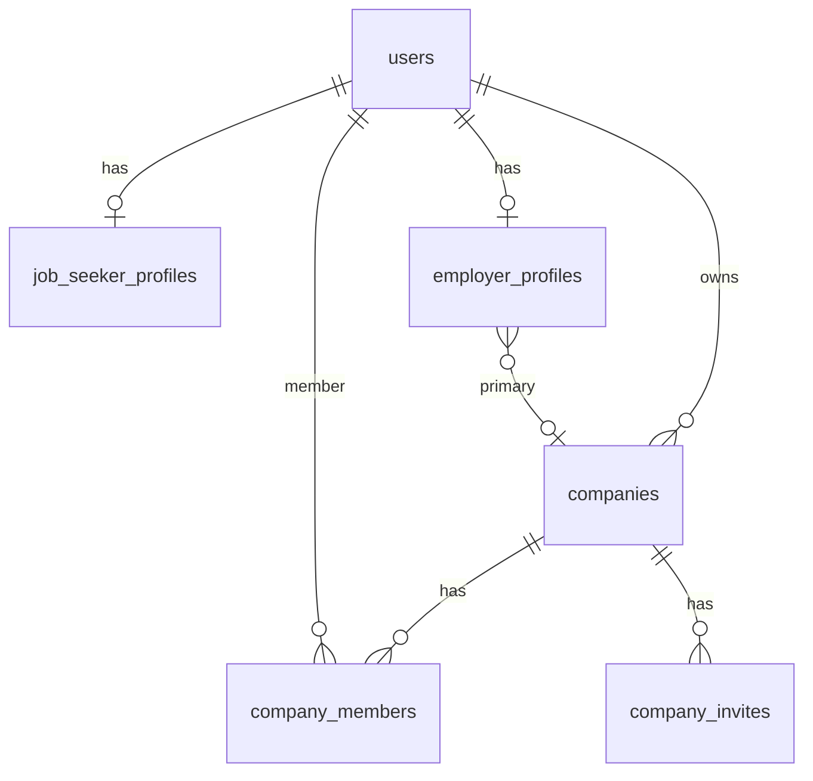

# Database Design — Phase 2: Profiles & Companies

**DBMS:** MySQL 8 · **ORM:** Prisma 6  
**فاز:** 2 — **Spec only — no migration yet**

---

## ۱. ERD (extensions)



---

## ۲. New Enums

```prisma
enum ProfileVisibility {
  PUBLIC
  EMPLOYERS_ONLY
  PRIVATE
}

enum EmployeeCountRange {
  SIZE_1_10
  SIZE_11_50
  SIZE_51_200
  SIZE_201_500
  SIZE_501_1000
  SIZE_1000_PLUS
}

enum CompanyVerificationStatus {
  PENDING
  VERIFIED
  REJECTED
}

enum CompanyInviteStatus {
  PENDING
  ACCEPTED
  EXPIRED
  REVOKED
}
```

`EmployerVerificationStatus` — unchanged from Phase 1.

---

## ۳. JobSeekerProfile (alter)

```prisma
model JobSeekerProfile {
  id                String             @id @default(uuid())
  userId            String             @unique @map("user_id")
  displayName       String?            @map("display_name") @db.VarChar(120)
  headline          String?            @db.VarChar(160)
  bio               String?            @db.Text
  avatarUrl         String?            @map("avatar_url") @db.VarChar(512)
  cityLabel         String?            @map("city_label") @db.VarChar(120)
  profileVisibility ProfileVisibility  @default(PRIVATE) @map("profile_visibility")
  completionScore   Int                @default(0) @map("completion_score")
  createdAt         DateTime           @default(now()) @map("created_at")
  updatedAt         DateTime           @updatedAt @map("updated_at")
  deletedAt         DateTime?          @map("deleted_at")

  user User @relation(fields: [userId], references: [id])

  @@map("job_seeker_profiles")
}
```

> `cityId` UUID FK deferred until Location Phase 3 — use `cityLabel` interim.

---

## ۴. EmployerProfile (alter)

```prisma
model EmployerProfile {
  id                 String                     @id @default(uuid())
  userId             String                     @unique @map("user_id")
  displayName        String?                    @map("display_name") @db.VarChar(120)
  jobTitle           String?                    @map("job_title") @db.VarChar(120)
  bio                String?                    @db.Text
  verificationStatus EmployerVerificationStatus @default(PENDING_REVIEW) @map("verification_status")
  companyId          String?                    @map("company_id")
  createdAt          DateTime                   @default(now()) @map("created_at")
  updatedAt          DateTime                   @updatedAt @map("updated_at")
  deletedAt          DateTime?                  @map("deleted_at")

  user    User     @relation(fields: [userId], references: [id])
  company Company? @relation(fields: [companyId], references: [id])

  @@map("employer_profiles")
}
```

---

## ۵. Company (alter)

```prisma
model Company {
  id                 String                    @id @default(uuid())
  name               String                    @db.VarChar(200)
  slug               String                    @unique @db.VarChar(220)
  description        String?                   @db.Text
  logoUrl            String?                   @map("logo_url") @db.VarChar(512)
  websiteUrl         String?                   @map("website_url") @db.VarChar(512)
  employeeCountRange EmployeeCountRange?       @map("employee_count_range")
  industryLabel      String?                   @map("industry_label") @db.VarChar(200)
  verificationStatus CompanyVerificationStatus @default(PENDING) @map("verification_status")
  verifiedAt         DateTime?                 @map("verified_at")
  ownerId            String                    @map("owner_id")
  createdAt          DateTime                  @default(now()) @map("created_at")
  updatedAt          DateTime                  @updatedAt @map("updated_at")
  deletedAt          DateTime?                 @map("deleted_at")

  owner            User              @relation("CompanyOwner", fields: [ownerId], references: [id])
  members          CompanyMember[]
  invites          CompanyInvite[]
  employerProfiles EmployerProfile[]

  @@index([ownerId])
  @@index([slug])
  @@index([verificationStatus])
  @@map("companies")
}
```

---

## ۶. CompanyInvite (new)

```prisma
model CompanyInvite {
  id         String              @id @default(uuid())
  companyId  String              @map("company_id")
  email      String              @db.VarChar(255)
  role       CompanyMemberRole   @default(MEMBER)
  tokenHash  String              @map("token_hash") @db.VarChar(64)
  status     CompanyInviteStatus @default(PENDING)
  invitedBy  String              @map("invited_by")
  expiresAt  DateTime            @map("expires_at")
  acceptedAt DateTime?           @map("accepted_at")
  createdAt  DateTime            @default(now()) @map("created_at")

  company Company @relation(fields: [companyId], references: [id])
  inviter User    @relation(fields: [invitedBy], references: [id])

  @@index([companyId])
  @@index([tokenHash])
  @@index([email])
  @@map("company_invites")
}
```

Add `User.companyInvitesSent CompanyInvite[]` relation.

---

## ۷. AuditAction extensions

```prisma
enum AuditAction {
  // ... Phase 1 values ...
  PROFILE_UPDATED
  COMPANY_CREATED
  COMPANY_UPDATED
  COMPANY_DELETED
  COMPANY_MEMBER_ADDED
  COMPANY_MEMBER_REMOVED
  COMPANY_INVITE_SENT
  COMPANY_OWNERSHIP_TRANSFERRED
  EMPLOYER_VERIFICATION_UPDATED
}
```

---

## ۸. Permission seeds (new)

| slug | name_fa |
|------|---------|
| profile:read:own | خواندن پروفایل خود |
| profile:update:own | ویرایش پروفایل خود |
| profile:read:any | خواندن پروفایل (admin) |
| company:read:own | خواندن شرکت خود |
| company:update:own | ویرایش شرکت |
| company:members:manage | مدیریت اعضا |
| company:invite | دعوت عضو |
| company:verify | تأیید شرکت (admin) |

---

## ۹. Migration

**Name:** `20260719160000_phase2_profiles_companies`

- ALTER job_seeker_profiles, employer_profiles, companies
- CREATE company_invites
- Seed permissions + role_permissions updates

---

## ۱۰. Indexes & constraints

- `companies.slug` unique among non-deleted (app-level or partial index note)
- `company_members` unique (companyId, userId) — existing
- Invite: one PENDING invite per (companyId, email)
