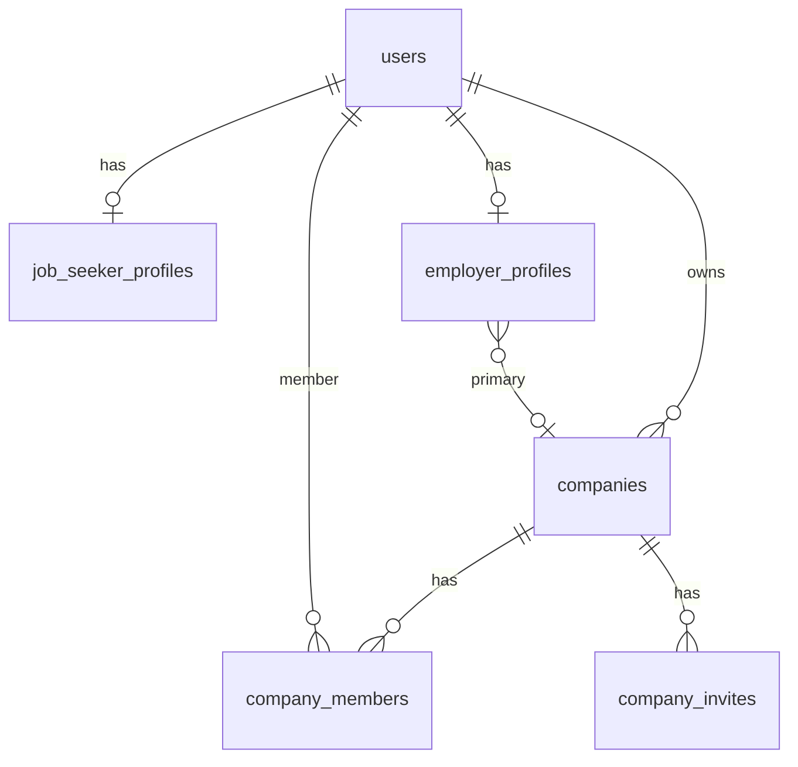

# Database Design — Phase 2: Profiles & Companies

**DBMS:** MySQL 8 · **ORM:** Prisma 6  
**فاز:** 2 — **Spec only — no migration yet**

---

## ۱. ERD (extensions)



---

## ۲. User (alter) — slug

```prisma
model User {
  // ... Phase 1 fields ...
  slug String? @unique @db.VarChar(220)

  @@index([slug])
}
```

Future URL: `/profiles/{slug}`

---

## ۳. Enums

### ProfileVisibility (unchanged)

```prisma
enum ProfileVisibility {
  PUBLIC
  EMPLOYERS_ONLY
  PRIVATE
}
```

### EmployerVerificationStatus (CTO — migrate Phase 1)

```prisma
enum EmployerVerificationStatus {
  PENDING        // was PENDING_REVIEW in Phase 1
  UNDER_REVIEW
  VERIFIED
  REJECTED
}
```

**Migration:** `PENDING_REVIEW` → `PENDING`

### CompanyVerificationStatus

```prisma
enum CompanyVerificationStatus {
  PENDING
  UNDER_REVIEW
  VERIFIED
  REJECTED
}
```

### CompanyStatus (new — CTO Condition 3)

```prisma
enum CompanyStatus {
  ACTIVE
  SUSPENDED
  DELETED
}
```

Default: `ACTIVE`. Admin can `SUSPEND`. Soft delete sets `status=DELETED` + `deletedAt`.

### EmployeeCountRange, CompanyInviteStatus

_(unchanged from v2.0 spec)_

---

## ۴. JobSeekerProfile (alter)

```prisma
model JobSeekerProfile {
  id                String             @id @default(uuid())
  userId            String             @unique @map("user_id")
  displayName       String?            @map("display_name") @db.VarChar(120)
  headline          String?            @db.VarChar(160)
  bio               String?            @db.Text
  avatarUrl         String?            @map("avatar_url") @db.VarChar(512)
  cityLabel         String?            @map("city_label") @db.VarChar(120)
  profileVisibility ProfileVisibility  @default(PRIVATE) @map("profile_visibility")
  completionScore   Int                @default(0) @map("completion_score")
  createdAt         DateTime           @default(now()) @map("created_at")
  updatedAt         DateTime           @updatedAt @map("updated_at")
  deletedAt         DateTime?          @map("deleted_at")

  user User @relation(fields: [userId], references: [id])

  @@map("job_seeker_profiles")
}
```

> **avatarUrl:** URL string only — no upload table Phase 2  
> **cityLabel:** interim until Phase 3 `cityId` FK

---

## ۵. EmployerProfile (alter)

Uses updated `EmployerVerificationStatus` enum (§۳).

---

## ۶. Company (alter)

```prisma
model Company {
  id                 String                    @id @default(uuid())
  name               String                    @db.VarChar(200)
  slug               String                    @unique @db.VarChar(220)
  description        String?                   @db.Text
  logoUrl            String?                   @map("logo_url") @db.VarChar(512)
  websiteUrl         String?                   @map("website_url") @db.VarChar(512)
  employeeCountRange EmployeeCountRange?       @map("employee_count_range")
  industryLabel      String?                   @map("industry_label") @db.VarChar(200)
  verificationStatus CompanyVerificationStatus @default(PENDING) @map("verification_status")
  status             CompanyStatus             @default(ACTIVE)
  verifiedAt         DateTime?                 @map("verified_at")
  ownerId            String                    @map("owner_id")
  createdAt          DateTime                  @default(now()) @map("created_at")
  updatedAt          DateTime                  @updatedAt @map("updated_at")
  deletedAt          DateTime?                 @map("deleted_at")

  owner            User              @relation("CompanyOwner", fields: [ownerId], references: [id])
  members          CompanyMember[]
  invites          CompanyInvite[]
  employerProfiles EmployerProfile[]

  @@index([ownerId])
  @@index([slug])
  @@index([verificationStatus])
  @@index([status])
  @@map("companies")
}
```

> **logoUrl:** URL string only — no upload logic Phase 2

---

## ۷. Future Taxonomy Migration (CTO Condition 7)

Phase 2:

```sql
industry_label VARCHAR(200) NULL
```

Phase 3 (planned):

```sql
ALTER TABLE companies ADD industry_id CHAR(36) NULL;
-- FK → taxonomy_industries(id)
-- Optional backfill: match industry_label → taxonomy slug
-- Deprecate industry_label after migration
```

Document in Phase 3 spec — **no `industryId` in Phase 2 migration**.

---

## ۸. Future Location Migration

Phase 2: `job_seeker_profiles.city_label`  
Phase 3: `city_id UUID FK` — nullable during transition

---

## ۹. CompanyInvite

_(unchanged — see prior spec)_

---

## ۱۰. AuditAction extensions (CTO Condition 5)

```prisma
enum AuditAction {
  // ... Phase 1 values ...
  PROFILE_UPDATED
  COMPANY_CREATED
  COMPANY_UPDATED
  COMPANY_DELETED
  MEMBER_INVITED
  MEMBER_ACCEPTED
  MEMBER_REMOVED
  OWNERSHIP_TRANSFERRED
  EMPLOYER_VERIFICATION_UPDATED
  COMPANY_VERIFICATION_UPDATED
  COMPANY_STATUS_CHANGED
}
```

---

## ۱۱. Permission seeds

_(unchanged — profile:*, company:*)_

Add optional: `company:suspend` (admin)

---

## ۱۲. Migration

**Name:** `20260719160000_phase2_profiles_companies`

1. ADD `users.slug`
2. ALTER job_seeker_profiles (new fields)
3. ALTER employer_profiles
4. Migrate `EmployerVerificationStatus` values
5. ALTER companies (slug, status, verification, industryLabel, …)
6. CREATE company_invites
7. Seed permissions
8. Extend AuditAction enum

---

## ۱۳. Indexes

- `users.slug` unique
- `companies.slug` unique
- Public query: `verificationStatus=VERIFIED AND status=ACTIVE AND deletedAt IS NULL`
