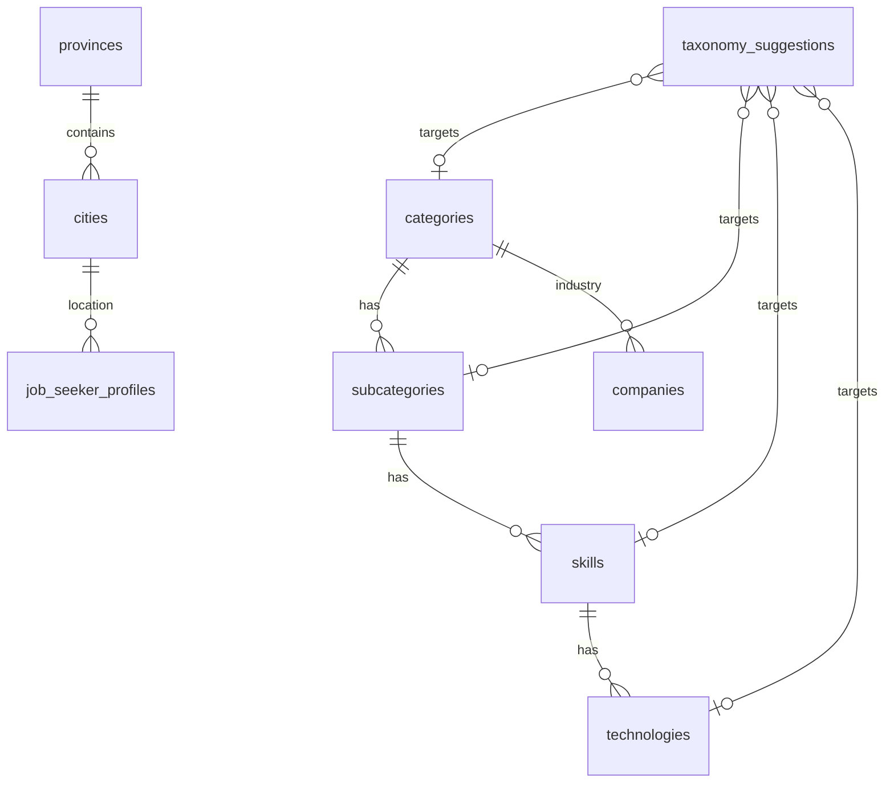

# Database Design — Phase 3: Location & Taxonomy

**DBMS:** MySQL 8 · **ORM:** Prisma 6  
**فاز:** 3 — **Spec only — no migration yet**

---

## ۱. ERD



---

## ۲. Location

### Province

```prisma
model Province {
  id        String   @id @default(uuid())
  nameFa    String   @map("name_fa") @db.VarChar(120)
  nameEn    String?  @map("name_en") @db.VarChar(120)
  slug      String   @unique @db.VarChar(120)
  isActive  Boolean  @default(true) @map("is_active")
  sortOrder Int      @default(0) @map("sort_order")
  createdAt DateTime @default(now()) @map("created_at")
  updatedAt DateTime @updatedAt @map("updated_at")

  cities City[]

  @@index([isActive, sortOrder])
  @@map("provinces")
}
```

### City

```prisma
model City {
  id         String   @id @default(uuid())
  provinceId String   @map("province_id")
  nameFa     String   @map("name_fa") @db.VarChar(120)
  nameEn     String?  @map("name_en") @db.VarChar(120)
  slug       String   @db.VarChar(120)
  isActive   Boolean  @default(true) @map("is_active")
  sortOrder  Int      @default(0) @map("sort_order")
  createdAt  DateTime @default(now()) @map("created_at")
  updatedAt  DateTime @updatedAt @map("updated_at")

  province          Province           @relation(fields: [provinceId], references: [id])
  jobSeekerProfiles JobSeekerProfile[]

  @@unique([provinceId, slug])
  @@index([provinceId, isActive])
  @@map("cities")
}
```

---

## ۳. Taxonomy

### Category

```prisma
model Category {
  id          String    @id @default(uuid())
  nameFa      String    @map("name_fa") @db.VarChar(120)
  nameEn      String?   @map("name_en") @db.VarChar(120)
  slug        String    @unique @db.VarChar(120)
  description String?   @db.Text
  isOfficial  Boolean   @default(true) @map("is_official")
  isActive    Boolean   @default(true) @map("is_active")
  sortOrder   Int       @default(0) @map("sort_order")
  createdAt   DateTime  @default(now()) @map("created_at")
  updatedAt   DateTime  @updatedAt @map("updated_at")
  deletedAt   DateTime? @map("deleted_at")

  subcategories SubCategory[]
  companies     Company[]

  @@index([isActive, sortOrder])
  @@map("categories")
}
```

### SubCategory, Skill, Technology

Same pattern: `nameFa`, `nameEn?`, `slug`, `isActive`, `sortOrder`, `deletedAt?`, parent FK.

```prisma
model SubCategory {
  id         String    @id @default(uuid())
  categoryId String    @map("category_id")
  nameFa     String    @map("name_fa") @db.VarChar(120)
  nameEn     String?   @map("name_en") @db.VarChar(120)
  slug       String    @db.VarChar(120)
  isActive   Boolean   @default(true) @map("is_active")
  sortOrder  Int       @default(0) @map("sort_order")
  createdAt  DateTime  @default(now()) @map("created_at")
  updatedAt  DateTime  @updatedAt @map("updated_at")
  deletedAt  DateTime? @map("deleted_at")

  category Category @relation(fields: [categoryId], references: [id])
  skills   Skill[]

  @@unique([categoryId, slug])
  @@map("subcategories")
}

model Skill {
  id            String    @id @default(uuid())
  subCategoryId String    @map("sub_category_id")
  nameFa        String    @map("name_fa") @db.VarChar(120)
  nameEn        String?   @map("name_en") @db.VarChar(120)
  slug          String    @unique @db.VarChar(120)
  isActive      Boolean   @default(true) @map("is_active")
  sortOrder     Int       @default(0) @map("sort_order")
  createdAt     DateTime  @default(now()) @map("created_at")
  updatedAt     DateTime  @updatedAt @map("updated_at")
  deletedAt     DateTime? @map("deleted_at")

  subCategory  SubCategory   @relation(fields: [subCategoryId], references: [id])
  technologies Technology[]

  @@index([subCategoryId, isActive])
  @@map("skills")
}

model Technology {
  id        String    @id @default(uuid())
  skillId   String    @map("skill_id")
  nameFa    String    @map("name_fa") @db.VarChar(120)
  nameEn    String?   @map("name_en") @db.VarChar(120)
  slug      String    @unique @db.VarChar(120)
  isActive  Boolean   @default(true) @map("is_active")
  sortOrder Int       @default(0) @map("sort_order")
  createdAt DateTime  @default(now()) @map("created_at")
  updatedAt DateTime  @updatedAt @map("updated_at")
  deletedAt DateTime? @map("deleted_at")

  skill Skill @relation(fields: [skillId], references: [id])

  @@index([skillId, isActive])
  @@map("technologies")
}
```

---

## ۴. TaxonomySuggestion

```prisma
enum TaxonomyEntityType {
  CATEGORY
  SUBCATEGORY
  SKILL
  TECHNOLOGY
}

enum TaxonomySuggestionSource {
  AI
  ADMIN
  USER
}

enum TaxonomySuggestionStatus {
  PENDING
  APPROVED
  REJECTED
  MERGED
}

model TaxonomySuggestion {
  id              String                   @id @default(uuid())
  entityType      TaxonomyEntityType       @map("entity_type")
  proposedNameFa  String                   @map("proposed_name_fa") @db.VarChar(120)
  proposedNameEn  String?                  @map("proposed_name_en") @db.VarChar(120)
  proposedSlug    String                   @map("proposed_slug") @db.VarChar(120)
  parentId        String?                  @map("parent_id") @db.VarChar(36)
  source          TaxonomySuggestionSource
  status          TaxonomySuggestionStatus @default(PENDING)
  aiMetadata      Json?                    @map("ai_metadata")
  reviewNote      String?                  @map("review_note") @db.Text
  mergedIntoId    String?                  @map("merged_into_id") @db.VarChar(36)
  createdById     String?                  @map("created_by_id")
  reviewedById    String?                  @map("reviewed_by_id")
  reviewedAt      DateTime?                @map("reviewed_at")
  createdAt       DateTime                 @default(now()) @map("created_at")
  updatedAt       DateTime                 @updatedAt @map("updated_at")

  createdBy  User? @relation("SuggestionCreatedBy", fields: [createdById], references: [id])
  reviewedBy User? @relation("SuggestionReviewedBy", fields: [reviewedById], references: [id])

  @@index([status, entityType])
  @@index([proposedSlug])
  @@map("taxonomy_suggestions")
}
```

---

## ۵. Phase 2 Alterations

### JobSeekerProfile

```prisma
model JobSeekerProfile {
  // ... existing ...
  cityId    String? @map("city_id")
  cityLabel String? @map("city_label") @db.VarChar(120) // deprecated — keep for migration

  city City? @relation(fields: [cityId], references: [id])

  @@index([cityId])
}
```

### Company

```prisma
model Company {
  // ... existing ...
  categoryId    String? @map("category_id")
  industryLabel String? @map("industry_label") @db.VarChar(200) // deprecated

  category Category? @relation(fields: [categoryId], references: [id])

  @@index([categoryId])
}
```

---

## ۶. AuditAction (extend)

```prisma
enum AuditAction {
  // ... Phase 1–2 ...
  PROVINCE_UPDATED
  CITY_UPDATED
  CATEGORY_CREATED
  CATEGORY_UPDATED
  CATEGORY_DELETED
  SUBCATEGORY_CREATED
  SUBCATEGORY_UPDATED
  SUBCATEGORY_DELETED
  SKILL_CREATED
  SKILL_UPDATED
  SKILL_DELETED
  TECHNOLOGY_CREATED
  TECHNOLOGY_UPDATED
  TECHNOLOGY_DELETED
  TAXONOMY_SUGGESTION_CREATED
  TAXONOMY_SUGGESTION_APPROVED
  TAXONOMY_SUGGESTION_REJECTED
  TAXONOMY_SUGGESTION_MERGED
}
```

---

## ۷. Migration Plan

**Migration name:** `20260719180000_phase3_location_taxonomy`

| Step | Action |
|------|--------|
| 1 | Create location + taxonomy tables |
| 2 | Seed 31 provinces + cities |
| 3 | Seed 15 categories (+ sample subcategories optional) |
| 4 | Add nullable `cityId`, `categoryId` |
| 5 | Backfill script (optional CLI): match labels → IDs |
| 6 | Seed permissions `location:*`, `taxonomy:*` |

**Rollback:** drop FKs first; keep label columns until Phase 4 if needed.

---

## ۸. Indexes & Performance

| Query | Index |
|-------|-------|
| Active provinces sorted | `(isActive, sortOrder)` |
| Cities by province | `(provinceId, isActive)` |
| Category tree | `(categoryId, slug)` unique |
| Skill by slug (SEO) | `skills.slug` unique |
| Pending suggestions | `(status, entityType)` |

---

## ۹. Seed Location

- `src/modules/location/seed/provinces.json` (or TS)
- `src/modules/location/seed/cities.json`
- `prisma/seed.ts` — invoke location + taxonomy seeders

**Source:** استان‌ها و شهرهای رسمی ایران — versioned in repo.
