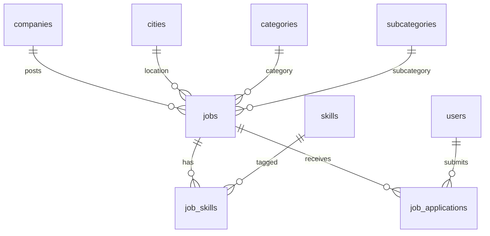

# Database Design — Phase 4: Jobs Core

**DBMS:** MySQL 8 · **ORM:** Prisma 6  
**فاز:** 4 — **Spec only — no migration yet**

---

## ۱. ERD



---

## ۲. Enums

```prisma
enum JobStatus {
  DRAFT
  PUBLISHED
  PAUSED
  CLOSED
  EXPIRED
  DELETED
}

enum EmploymentType {
  FULL_TIME
  PART_TIME
  CONTRACT
  REMOTE
  HYBRID
}

enum ExperienceLevel {
  INTERN
  JUNIOR
  MID
  SENIOR
  LEAD
  PRINCIPAL
}

enum ApplicationStatus {
  SUBMITTED
  WITHDRAWN
  REJECTED
  SHORTLISTED
  HIRED
}
```

> `HIRED` stored for lifecycle — full hiring workflow later.

---

## ۳. Job

```prisma
model Job {
  id               String           @id @default(uuid())
  companyId        String           @map("company_id")
  createdById      String           @map("created_by_id")
  title            String           @db.VarChar(200)
  slug             String           @unique @db.VarChar(220)
  description      String           @db.Text
  cityId           String           @map("city_id")
  categoryId       String           @map("category_id")
  subCategoryId    String?          @map("sub_category_id")
  employmentType   EmploymentType   @map("employment_type")
  experienceLevel  ExperienceLevel? @map("experience_level")
  salaryMin        Int?             @map("salary_min")
  salaryMax        Int?             @map("salary_max")
  salaryCurrency   String?          @default("IRR") @map("salary_currency") @db.VarChar(3)
  showSalary       Boolean          @default(false) @map("show_salary")
  status           JobStatus        @default(DRAFT)
  publishedAt      DateTime?        @map("published_at")
  expiresAt        DateTime?        @map("expires_at")
  closedAt         DateTime?        @map("closed_at")
  createdAt        DateTime         @default(now()) @map("created_at")
  updatedAt        DateTime         @updatedAt @map("updated_at")
  deletedAt        DateTime?        @map("deleted_at")

  company       Company        @relation(fields: [companyId], references: [id])
  city          City           @relation(fields: [cityId], references: [id])
  category      Category       @relation(fields: [categoryId], references: [id])
  subCategory   SubCategory?   @relation(fields: [subCategoryId], references: [id])
  createdBy     User           @relation("JobCreatedBy", fields: [createdById], references: [id])
  skills        JobSkill[]
  applications  JobApplication[]

  @@index([companyId, status])
  @@index([status, publishedAt])
  @@index([cityId])
  @@index([categoryId])
  @@index([expiresAt])
  @@map("jobs")
}
```

---

## ۴. JobSkill (M2M)

```prisma
model JobSkill {
  jobId   String @map("job_id")
  skillId String @map("skill_id")

  job   Job   @relation(fields: [jobId], references: [id], onDelete: Cascade)
  skill Skill @relation(fields: [skillId], references: [id])

  @@id([jobId, skillId])
  @@map("job_skills")
}
```

Max 10 skills enforced in service layer.

---

## ۵. JobApplication

```prisma
model JobApplication {
  id          String            @id @default(uuid())
  jobId       String            @map("job_id")
  userId      String            @map("user_id")
  status      ApplicationStatus @default(SUBMITTED)
  coverLetter String?           @map("cover_letter") @db.Text
  resumeId    String?           @map("resume_id") // Phase 5 — null allowed
  submittedAt DateTime          @default(now()) @map("submitted_at")
  updatedAt   DateTime          @updatedAt @map("updated_at")
  withdrawnAt DateTime?         @map("withdrawn_at")
  deletedAt   DateTime?         @map("deleted_at")

  job  Job  @relation(fields: [jobId], references: [id])
  user User @relation(fields: [userId], references: [id])

  @@unique([jobId, userId])
  @@index([userId])
  @@index([jobId, status])
  @@map("job_applications")
}
```

---

## ۶. User relation (alter)

```prisma
model User {
  // ...
  jobsCreated       Job[]            @relation("JobCreatedBy")
  jobApplications   JobApplication[]
}
```

---

## ۷. AuditAction (extend)

```prisma
enum AuditAction {
  // ... Phase 1–3 ...
  JOB_CREATED
  JOB_UPDATED
  JOB_PUBLISHED
  JOB_PAUSED
  JOB_CLOSED
  JOB_DELETED
  APPLICATION_SUBMITTED
  APPLICATION_WITHDRAWN
  APPLICATION_STATUS_CHANGED
}
```

---

## ۸. Migration Plan

**Name:** `20260719200000_phase4_jobs_core`

| Step | Action |
|------|--------|
| 1 | Create enums + jobs, job_skills, job_applications |
| 2 | FK to companies, cities, categories, subcategories, users |
| 3 | Seed job permissions |
| 4 | Index for public list queries |

---

## ۹. Business Rules (DB + service)

| Rule | Enforcement |
|------|-------------|
| Publish requires verified company | service |
| One active application per user per job | unique `[jobId, userId]` |
| Public read PUBLISHED + not expired | service query |
| Employer must be company member | assertCompanyAccess |
