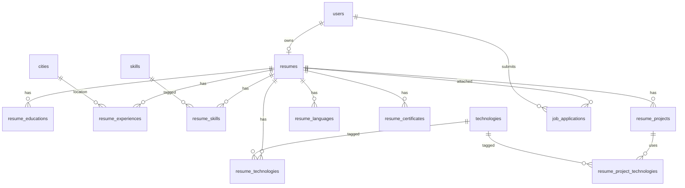

# Database Design — Phase 5: Resume Builder

**DBMS:** MySQL 8 · **ORM:** Prisma 6  
**فاز:** 5 — **Spec only — no migration yet**

---

## ۱. ERD



---

## ۲. Enums

```prisma
enum ResumeVisibility {
  PUBLIC
  EMPLOYERS_ONLY
  PRIVATE
}

enum LanguageProficiency {
  NATIVE
  FLUENT
  ADVANCED
  INTERMEDIATE
  BASIC
}

enum SkillProficiency {
  BEGINNER
  INTERMEDIATE
  ADVANCED
  EXPERT
}
```

> Reuse `EmploymentType` from Phase 4 on `ResumeExperience`.

---

## ۳. Resume (one per user)

```prisma
model Resume {
  id              String           @id @default(uuid())
  userId          String           @unique @map("user_id")
  title           String?          @db.VarChar(160)
  summary         String?          @db.Text
  visibility      ResumeVisibility @default(PRIVATE)
  completionScore Int              @default(0) @map("completion_score")
  createdAt       DateTime         @default(now()) @map("created_at")
  updatedAt       DateTime         @updatedAt @map("updated_at")
  deletedAt       DateTime?        @map("deleted_at")

  user           User                 @relation(fields: [userId], references: [id])
  educations     ResumeEducation[]
  experiences    ResumeExperience[]
  skills         ResumeSkill[]
  technologies   ResumeTechnology[]
  languages      ResumeLanguage[]
  certificates   ResumeCertificate[]
  projects       ResumeProject[]
  applications   JobApplication[]

  @@index([visibility])
  @@map("resumes")
}
```

**Constraint R-1:** `@unique userId` — one resume row per user (soft delete: set `deletedAt`; recreate blocked until hard policy defined — spec: no recreate; restore via undelete admin future).

---

## ۴. Section Models

### ResumeEducation

```prisma
model ResumeEducation {
  id           String    @id @default(uuid())
  resumeId     String    @map("resume_id")
  institution  String    @db.VarChar(200)
  degree       String?   @db.VarChar(120)
  fieldOfStudy String?   @map("field_of_study") @db.VarChar(120)
  startDate    DateTime  @map("start_date") @db.Date
  endDate      DateTime? @map("end_date") @db.Date
  isCurrent    Boolean   @default(false) @map("is_current")
  description  String?   @db.Text
  sortOrder    Int       @default(0) @map("sort_order")
  createdAt    DateTime  @default(now()) @map("created_at")
  updatedAt    DateTime  @updatedAt @map("updated_at")

  resume Resume @relation(fields: [resumeId], references: [id], onDelete: Cascade)

  @@index([resumeId, sortOrder])
  @@map("resume_educations")
}
```

### ResumeExperience

```prisma
model ResumeExperience {
  id             String            @id @default(uuid())
  resumeId       String            @map("resume_id")
  companyName    String            @map("company_name") @db.VarChar(200)
  title          String            @db.VarChar(160)
  employmentType EmploymentType?   @map("employment_type")
  cityId         String?           @map("city_id")
  startDate      DateTime          @map("start_date") @db.Date
  endDate        DateTime?         @map("end_date") @db.Date
  isCurrent      Boolean           @default(false) @map("is_current")
  description    String?           @db.Text
  sortOrder      Int               @default(0) @map("sort_order")
  createdAt      DateTime          @default(now()) @map("created_at")
  updatedAt      DateTime          @updatedAt @map("updated_at")

  resume Resume @relation(fields: [resumeId], references: [id], onDelete: Cascade)
  city   City?  @relation(fields: [cityId], references: [id])

  @@index([resumeId, sortOrder])
  @@map("resume_experiences")
}
```

### ResumeSkill / ResumeTechnology

```prisma
model ResumeSkill {
  resumeId    String            @map("resume_id")
  skillId     String            @map("skill_id")
  proficiency SkillProficiency?
  sortOrder   Int               @default(0) @map("sort_order")

  resume Resume @relation(fields: [resumeId], references: [id], onDelete: Cascade)
  skill  Skill  @relation(fields: [skillId], references: [id])

  @@id([resumeId, skillId])
  @@map("resume_skills")
}

model ResumeTechnology {
  resumeId     String            @map("resume_id")
  technologyId String            @map("technology_id")
  proficiency  SkillProficiency?
  sortOrder    Int               @default(0) @map("sort_order")

  resume     Resume     @relation(fields: [resumeId], references: [id], onDelete: Cascade)
  technology Technology @relation(fields: [technologyId], references: [id])

  @@id([resumeId, technologyId])
  @@map("resume_technologies")
}
```

### ResumeLanguage

```prisma
model ResumeLanguage {
  id           String              @id @default(uuid())
  resumeId     String              @map("resume_id")
  languageCode String              @map("language_code") @db.VarChar(10)
  languageName String              @map("language_name") @db.VarChar(80)
  proficiency  LanguageProficiency
  sortOrder    Int                 @default(0) @map("sort_order")
  createdAt    DateTime            @default(now()) @map("created_at")
  updatedAt    DateTime            @updatedAt @map("updated_at")

  resume Resume @relation(fields: [resumeId], references: [id], onDelete: Cascade)

  @@index([resumeId, sortOrder])
  @@map("resume_languages")
}
```

### ResumeCertificate / ResumeProject

```prisma
model ResumeCertificate {
  id            String    @id @default(uuid())
  resumeId      String    @map("resume_id")
  name          String    @db.VarChar(200)
  issuer        String?   @db.VarChar(200)
  issueDate     DateTime? @map("issue_date") @db.Date
  expiryDate    DateTime? @map("expiry_date") @db.Date
  credentialId  String?   @map("credential_id") @db.VarChar(120)
  credentialUrl String?   @map("credential_url") @db.VarChar(512)
  sortOrder     Int       @default(0) @map("sort_order")
  createdAt     DateTime  @default(now()) @map("created_at")
  updatedAt     DateTime  @updatedAt @map("updated_at")

  resume Resume @relation(fields: [resumeId], references: [id], onDelete: Cascade)

  @@index([resumeId, sortOrder])
  @@map("resume_certificates")
}

model ResumeProject {
  id          String    @id @default(uuid())
  resumeId    String    @map("resume_id")
  title       String    @db.VarChar(200)
  description String?   @db.Text
  url         String?   @db.VarChar(512)
  startDate   DateTime? @map("start_date") @db.Date
  endDate     DateTime? @map("end_date") @db.Date
  sortOrder   Int       @default(0) @map("sort_order")
  createdAt   DateTime  @default(now()) @map("created_at")
  updatedAt   DateTime  @updatedAt @map("updated_at")

  resume       Resume                    @relation(fields: [resumeId], references: [id], onDelete: Cascade)
  technologies ResumeProjectTechnology[]

  @@index([resumeId, sortOrder])
  @@map("resume_projects")
}

model ResumeProjectTechnology {
  projectId    String @map("project_id")
  technologyId String @map("technology_id")

  project    ResumeProject @relation(fields: [projectId], references: [id], onDelete: Cascade)
  technology Technology    @relation(fields: [technologyId], references: [id])

  @@id([projectId, technologyId])
  @@map("resume_project_technologies")
}
```

---

## ۵. JobApplication FK

Extend Phase 4:

```prisma
model JobApplication {
  // ... existing fields
  resumeId String? @map("resume_id")

  resume Resume? @relation(fields: [resumeId], references: [id])
}
```

Add index `@@index([resumeId])`.

---

## ۶. AuditAction extensions

```prisma
// Add to AuditAction enum:
RESUME_CREATED
RESUME_UPDATED
RESUME_VISIBILITY_CHANGED
RESUME_EDUCATION_CREATED
RESUME_EDUCATION_UPDATED
RESUME_EDUCATION_DELETED
RESUME_EXPERIENCE_CREATED
RESUME_EXPERIENCE_UPDATED
RESUME_EXPERIENCE_DELETED
RESUME_SKILL_UPDATED
RESUME_TECHNOLOGY_UPDATED
RESUME_LANGUAGE_CREATED
RESUME_LANGUAGE_UPDATED
RESUME_LANGUAGE_DELETED
RESUME_CERTIFICATE_CREATED
RESUME_CERTIFICATE_UPDATED
RESUME_CERTIFICATE_DELETED
RESUME_PROJECT_CREATED
RESUME_PROJECT_UPDATED
RESUME_PROJECT_DELETED
```

---

## ۷. Migration

**Name:** `20260719210000_phase5_resume_builder`

**Seed permissions:** `resume:read:own`, `resume:update:own`, `resume:read:employer`, `resume:read:public`

---

## ۸. User relation

Add to `User` model:

```prisma
resume Resume?
```

Add relations on `Skill`, `Technology`, `City` as shown above.
