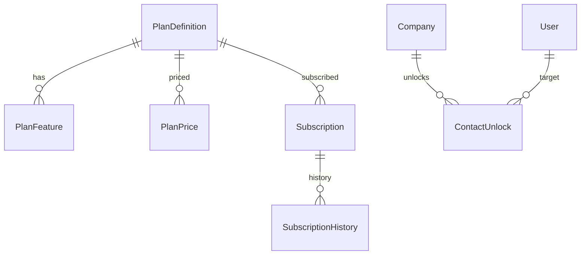

# Database Design — Phase 7A

**DBMS:** MySQL 8 · Prisma 6 · **Migration:** `phase7a_billing_entitlements`  
**7B tables (Payment*): not in this migration**

---

## ERD (7A)



---

## Enums

```prisma
enum PlanAudience { SEEKER EMPLOYER }
enum BillingOwnerType { USER COMPANY }
enum FeaturePeriod { NONE DAY MONTH YEAR }
enum SubscriptionStatus { ACTIVE CANCELED EXPIRED PAST_DUE }
enum ConsumableType { JOB_POST RESUME_VIEW CONTACT_UNLOCK FEATURED_DAY AI_CREDIT }
enum ConsumableTxKind { CREDIT DEBIT RESERVE CAPTURE RELEASE }
enum SubscriptionHistoryEvent {
  CREATED ACTIVATED PLAN_CHANGED CANCELED RENEWED EXPIRED ADMIN_OVERRIDE
}
```

---

## Models

### PlanDefinition

`id`, `slug` unique, `audience`, `nameFa`, `nameEn?`, `isActive`, `sortOrder`, timestamps

### PlanFeature

`id`, `planId`, `featureKey`, `limitValue` Int? (null=unlimited), `period` FeaturePeriod,  
`rollover` Boolean, `version` Int, `effectiveFrom` DateTime, `effectiveTo` DateTime?, timestamps  

@@index([planId, featureKey, effectiveFrom])

### PlanPrice

`id`, `sku` unique, `planId?`, `consumableType?`, `packQuantity?`,  
`amount` Int, `currency` VarChar(3) default "IRR", `periodMonths` Int?, `isActive`, timestamps

### Subscription

`id`, `ownerType`, `ownerId`, `planId`, `status`, `currentPeriodStart`, `currentPeriodEnd`,  
`cancelAtPeriodEnd` Boolean, timestamps  
@@unique([ownerType, ownerId]) // one active binding row; history separate

### SubscriptionHistory

`id`, `subscriptionId`, `event`, `fromPlanId?`, `toPlanId?`, `note?`, `actorUserId?`, `metadata` Json?, `createdAt`  
@@index([subscriptionId, createdAt])

### ConsumableBalance

`id`, `ownerType`, `ownerId`, `consumableType`, `available` Int, `reserved` Int  
@@unique([ownerType, ownerId, consumableType])

### ConsumableTransaction

`id`, `ownerType`, `ownerId`, `consumableType`, `delta` Int, `kind`, `refType?`, `refId?`,  
`requestId?`, `metadata` Json?, `createdAt`  
@@index([ownerType, ownerId, createdAt])  
@@unique([ownerType, ownerId, requestId]) // when requestId set — partial via app logic

### QuotaUsage

`id`, `ownerType`, `ownerId`, `featureKey`, `periodKey`, `used` Int  
@@unique([ownerType, ownerId, featureKey, periodKey])

### SystemSetting

`key` unique, `valueJson` Json, `updatedAt`, `updatedById?`

### ContactUnlock

`id`, `companyId`, `targetUserId`, `unlockedByUserId`, `consumableTxId?`, `createdAt`  
@@unique([companyId, targetUserId])

---

## Quota periodKey

Timezone: `SystemSetting` `billing.timezone` (seed `Asia/Tehran`).  
DAY=`YYYY-MM-DD` · MONTH=`YYYY-MM` · YEAR=`YYYY` · NONE=`lifetime`

Job `billing.ensurePeriodBoundaries` — billing module · BullMQ — hourly.

---

## 7B (not migrated now)

`Payment`, `PaymentAttempt` — amount+currency, gatewayRef, status, idempotencyKey
